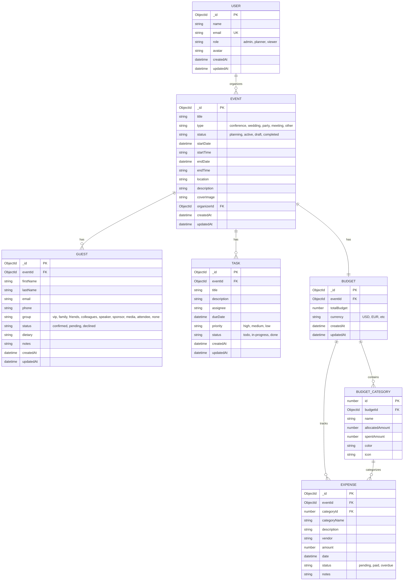

# Event Planner Database Schema

## Entity Relationship Diagram



## Collection Details

### Users Collection
- **Purpose**: Store user accounts and authentication data
- **Key Fields**: 
  - `role`: Defines user permissions (admin, planner, viewer)
  - `email`: Unique identifier for login
  - `avatar`: Profile picture URL

### Events Collection
- **Purpose**: Core event information and metadata
- **Key Fields**:
  - `type`: Event category for filtering and organization
  - `status`: Workflow state tracking
  - `organizerId`: Links to the user who created the event
  - `coverImage`: Visual representation for the event

### Guests Collection
- **Purpose**: Track attendees and RSVPs for each event
- **Key Fields**:
  - `eventId`: Links guest to specific event
  - `group`: Categorizes guests for seating/organization
  - `status`: RSVP status tracking
  - `dietary`: Special meal requirements

### Tasks Collection
- **Purpose**: Project management and task tracking per event
- **Key Fields**:
  - `eventId`: Links task to specific event
  - `assignee`: Person responsible for completion
  - `priority`: Urgency level
  - `status`: Progress tracking

### Budgets Collection
- **Purpose**: Financial planning and tracking for events
- **Key Fields**:
  - `eventId`: One-to-one relationship with events
  - `totalBudget`: Overall budget cap
  - `categories`: Embedded array of budget allocations
  - `expenses`: Embedded array of actual spending

### Budget Categories (Embedded)
- **Purpose**: Organize budget into spending categories
- **Key Fields**:
  - `allocatedAmount`: Planned spending
  - `spentAmount`: Actual spending
  - `color` & `icon`: UI visualization

### Expenses (Embedded)
- **Purpose**: Track individual transactions and payments
- **Key Fields**:
  - `categoryId`: Links to budget category
  - `vendor`: Payment recipient
  - `status`: Payment state tracking
  - `date`: Transaction date

## Relationships

1. **User → Event** (One-to-Many)
   - A user can organize multiple events
   - Each event has one organizer

2. **Event → Guest** (One-to-Many)
   - An event can have multiple guests
   - Each guest belongs to one event

3. **Event → Task** (One-to-Many)
   - An event can have multiple tasks
   - Each task belongs to one event

4. **Event → Budget** (One-to-One)
   - Each event has exactly one budget
   - Each budget belongs to one event

5. **Budget → Categories** (One-to-Many, Embedded)
   - A budget contains multiple categories
   - Categories are embedded documents

6. **Budget → Expenses** (One-to-Many, Embedded)
   - A budget tracks multiple expenses
   - Expenses are embedded documents

7. **Category → Expense** (One-to-Many, Reference)
   - Expenses reference their category by ID
   - Multiple expenses can belong to one category

## Indexes Recommendations

```javascript
// Users
db.users.createIndex({ email: 1 }, { unique: true })
db.users.createIndex({ role: 1 })

// Events
db.events.createIndex({ organizerId: 1 })
db.events.createIndex({ status: 1 })
db.events.createIndex({ startDate: 1 })
db.events.createIndex({ type: 1 })

// Guests
db.guests.createIndex({ eventId: 1 })
db.guests.createIndex({ email: 1 })
db.guests.createIndex({ status: 1 })

// Tasks
db.tasks.createIndex({ eventId: 1 })
db.tasks.createIndex({ status: 1 })
db.tasks.createIndex({ dueDate: 1 })
db.tasks.createIndex({ assignee: 1 })

// Budgets
db.budgets.createIndex({ eventId: 1 }, { unique: true })

// Expenses (if separated from budgets)
db.expenses.createIndex({ eventId: 1 })
db.expenses.createIndex({ categoryId: 1 })
db.expenses.createIndex({ status: 1 })
db.expenses.createIndex({ date: 1 })
```

## Data Integrity Rules

1. **Cascading Deletes**:
   - Deleting an event should delete all associated guests, tasks, and budget
   - Deleting a user should reassign or delete their events

2. **Required Fields**:
   - User: name, email, role
   - Event: title, type, status, startDate, location, organizerId
   - Guest: eventId, firstName, lastName, email, status
   - Task: eventId, title, priority, status
   - Budget: eventId, totalBudget, currency

3. **Validation**:
   - Email format validation
   - Date validation (endDate >= startDate)
   - Budget validation (spentAmount <= allocatedAmount warnings)
   - Enum validation for status, type, priority, etc.
