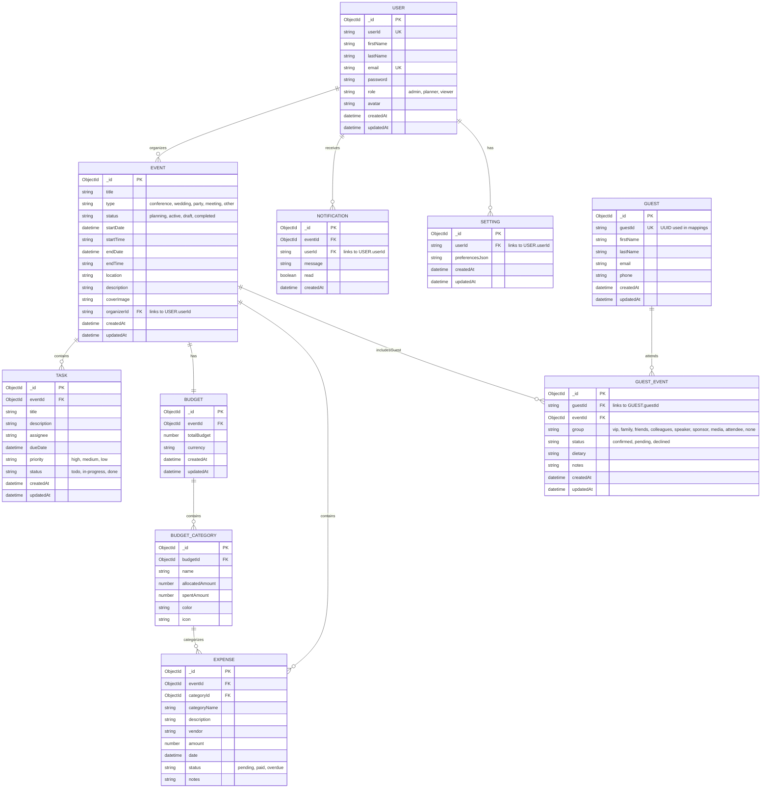

# Event Planner Database Schema

## Entity Relationship Diagram



## Collection Details

### Users Collection
- **Purpose**: Store user accounts and authentication data
- **Key Fields**:
  - `userId`: UUID used for linking to other entities
  - `role`: Defines user permissions (admin, planner, viewer)
  - `email`: Unique identifier for login
  - `avatar`: Profile picture URL

### Events Collection
- **Purpose**: Core event information and metadata
- **Key Fields**:
  - `type`: Event category for filtering and organization
  - `status`: Workflow state tracking
  - `organizerId`: Links to the user who created the event (USER.userId)
  - `coverImage`: Visual representation for the event
  - `startTime`/`endTime`: Specific time details

### Guests Collection
- **Purpose**: Store unique guest profiles independent of events
- **Key Fields**:
  - `guestId`: UUID used for linking to events
  - `email`: Contact information

### Guest Events Collection
- **Purpose**: Link guests to specific events with event-specific details
- **Key Fields**:
  - `guestId`: Link to Guest profile
  - `eventId`: Link to Event
  - `group`: Categorization within the event
  - `status`: RSVP status
  - `dietary`: Event-specific dietary needs

### Tasks Collection
- **Purpose**: Project management and task tracking per event
- **Key Fields**:
  - `eventId`: Links task to specific event
  - `assignee`: Person responsible for completion
  - `priority`: Urgency level
  - `status`: Progress tracking

### Budgets Collection
- **Purpose**: Financial planning and tracking for events
- **Key Fields**:
  - `eventId`: One-to-one relationship with events
  - `totalBudget`: Overall budget cap

### Budget Categories
- **Purpose**: Organize budget into spending categories
- **Key Fields**:
  - `budgetId`: Link to parent budget
  - `allocatedAmount`: Planned spending
  - `spentAmount`: Actual spending

### Expenses
- **Purpose**: Track individual transactions and payments
- **Key Fields**:
  - `eventId`: Link to event
  - `categoryId`: Link to budget category
  - `vendor`: Payment recipient
  - `status`: Payment state tracking

### Notifications Collection
- **Purpose**: User notifications
- **Key Fields**:
  - `userId`: Recipient user
  - `eventId`: Related event (optional)
  - `read`: Read status

### Settings Collection
- **Purpose**: User preferences
- **Key Fields**:
  - `userId`: Link to user
  - `preferencesJson`: JSON string storing various preferences

## Indexes Recommendations

```javascript
// Users
db.users.createIndex({ userId: 1 }, { unique: true })
db.users.createIndex({ email: 1 }, { unique: true })

// Events
db.events.createIndex({ organizerId: 1 })
db.events.createIndex({ status: 1 })
db.events.createIndex({ startDate: 1 })

// Guests
db.guests.createIndex({ guestId: 1 }, { unique: true })
db.guests.createIndex({ email: 1 })

// Guest Events
db.guest_events.createIndex({ eventId: 1 })
db.guest_events.createIndex({ guestId: 1 })
db.guest_events.createIndex({ eventId: 1, guestId: 1 }, { unique: true })

// Tasks
db.tasks.createIndex({ eventId: 1 })
db.tasks.createIndex({ assignee: 1 })

// Budgets
db.budgets.createIndex({ eventId: 1 }, { unique: true })

// Budget Categories
db.budget_categories.createIndex({ budgetId: 1 })

// Expenses
db.expenses.createIndex({ eventId: 1 })
db.expenses.createIndex({ categoryId: 1 })

// Notifications
db.notifications.createIndex({ userId: 1 })
db.notifications.createIndex({ read: 1 })

// Settings
db.settings.createIndex({ userId: 1 }, { unique: true })
```
